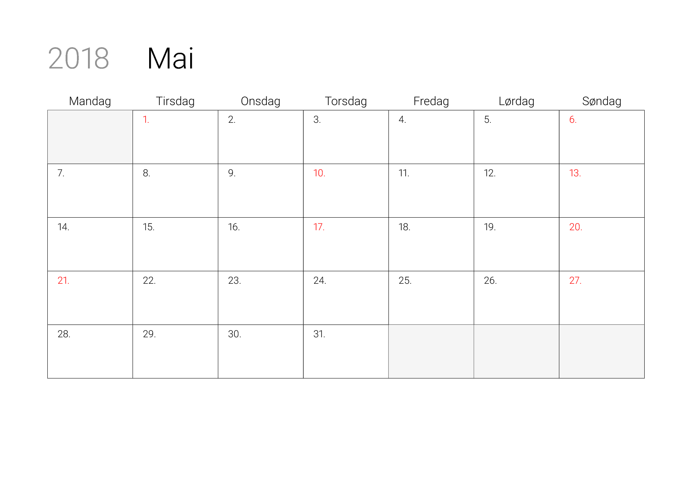

# calgen
Calgen will generate pretty printable monthly calendars with Norwegian holydays highlighted. 

Written in Python 3. It also requires a working LaTeX installation to produce PDFs. 

### Usage
To generate calendars, run calgen with the requested year as an argument:
``` bash
$ python3 calgen.py 2018
```
If you only want calendars for certain months, list them as additional arguments:
``` bash
$ python3 calgen.py 2018 10 11 12
```
Months are indexed from 1, ie, 1 is januar, 2 is february, and so on.


### Example


